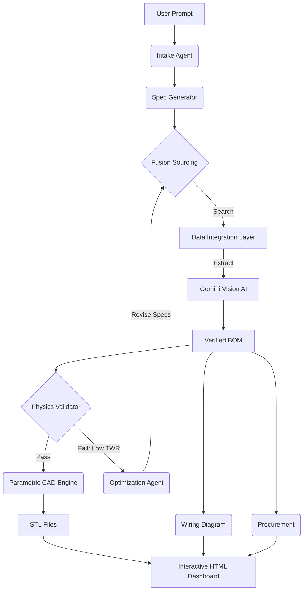

## Version Notes- 11-21-22 improving simulation.  cad designs seem off this may be due to muliple simulation runs confusing the final output.  Instead of library.scad having a pre-defined pro_frame module, the AI would define constraints (Keep-Out Zones, Bolt Points, Max Stress), and you would use a Python library (like trimesh or cadquery) to mathematically generate the mesh connectivity between those points.

# OpenForge-
**A Hardware-Aware Agentic Framework for Autonomous Engineering.**

[](https://www.gnu.org/licenses/agpl-3.0)
[](https://www.python.org/downloads/)
[](https://deepmind.google/technologies/gemini/)
[]()

> **"Neuro-Symbolic Architecture for Physical Systems: AI for Reasoning, Code for Physics."**

---

## 📜 Overview

OpenForge is an experiment in **Agentic Manufacturing**. It demonstrates how Large Language Models (LLMs) can be grounded in physical reality by chaining them with deterministic engineering tools.

Unlike standard chatbots that hallucinate physical specifications, OpenForge uses a **Neuro-Symbolic Architecture**:
1.  **The Neural Layer (AI):** Handles intent understanding, component selection, and strategic reasoning.
2.  **The Symbolic Layer (Code):** Handles physics validation, parametric CAD generation, and cost aggregation.

**Current Status:** This repository is a Digital Twin simulation. It demonstrates the full architectural capability—from user prompt to manufacturing files—using a mix of live logic and simulated data sources to ensure safety and stability.

---

## 🧠 Architecture: The Self-Healing Loop

The core differentiator of OpenForge is the **Optimization Agent**. It does not just generate a list of parts; it validates them against a physics engine.

If a build fails simulation (e.g., `Thrust-to-Weight Ratio < 1.5`), the system does not crash. The Optimization Agent analyzes the failure, reasons about the necessary engineering changes (e.g., *"Increase motor stator size for higher torque"*), swaps the components, and re-simulates until the design passes.



---

## ✨ Key Capabilities

*   **⚛️ Data Fusion Sourcing:** A framework for orchestrating parallel searches across multiple vendors. The system is designed to merge pricing data with technical specifications to create a "Composite Component" record.
*   **👁️ Visual Spec Extraction:** Leveraging **Gemini Pro Vision** to extract engineering constraints (e.g., mounting patterns, shaft diameters) directly from technical diagrams, bypassing unreliable text descriptions.
*   **🚀 Physics Validation:** A deterministic physics engine (`calc_twr.py`) that calculates Thrust-to-Weight Ratios (TWR), Disk Loading, and estimated flight times. This acts as a "hard guardrail" against AI hallucination.
*   **📐 Parametric CAD Generation:** Dynamically injects validated dimensions into **OpenSCAD** scripts to generate bespoke `.stl` frame files tailored to the specific components selected by the AI.
*   **⚡ Automated Schematics:** Generates visual wiring diagrams using **Graphviz**, mapping logical connections (UARTs, Voltage Pads) based on the specific pinouts of the selected flight controller.

---

## ⚠️ Simulation vs. Live Mode

**Please Note:** This repository is configured for **Safe Mode** by default.

*   **Live Sourcing:** To prevent dual-use risks and avoid triggering anti-bot defenses on e-commerce sites during public testing, the `recon_service.py` and `search_service.py` modules are currently configured to return **deterministic mock data**.
*   **The Logic is Real:** The reasoning agents, physics engine, CAD generation, and optimization loops are fully functional. The system processes the mock data *as if* it were live, demonstrating the system's ability to handle engineering constraints and failures.
*   **For Developers:** You can enable live sourcing by implementing the `AbstractScraper` interface in `recon_service.py` with your own API keys or scraping logic.

---

## 🛠️ Tech Stack

*   **Core:** Python 3.10+ (AsyncIO, FastAPI)
*   **AI Orchestration:** Google Gemini Pro (Reasoning) + Gemini Pro Vision (Extraction)
*   **Engineering:** OpenSCAD (Parametric Modeling), Graphviz (Schematics), NumPy (Physics)
*   **Visualization:** Three.js & WebGL (Interactive Dashboard)

---

## 🚀 Getting Started

### Prerequisites
*   **Python 3.10+**
*   **Google Gemini API Key** (Free tier available)
*   **OpenSCAD** (Must be in system PATH)
*   **Graphviz** (Must be in system PATH)

### 1. Installation
```bash
git clone https://github.com/yourusername/OpenForge.git
cd OpenForge
pip install -r requirements.txt
```

### 2. Configuration
Create a `.env` file:
```bash
GOOGLE_API_KEY="your_gemini_key_here"
```

### 3. Run the Master Simulation
To witness the full Intake -> Design -> Optimize -> Build lifecycle:

```bash
python -m scripts.prof_grade_test
```

This will generate a `master_build_guide.html` in `static/generated`. Open this file in your browser to see the interactive 3D model, wiring diagram, and cost breakdown.

---

## 🤝 Contributing

This project is a framework for **Hardware-Aware AI**. We are looking for contributors to help expand the "Vertical Slice" beyond drones:

*   **Physics:** Implement FEA (Finite Element Analysis) for structural validation.
*   **Sourcing:** Add adapters for industrial APIs (DigiKey, Mouser).
*   **Domains:** Adapt the constraint logic for other domains (e.g., PCB Assembly, 3D Printer gantries).

---

## 📜 License

**AGPL v3 License.**

*   **Open Source:** Free to use and modify for open projects.
*   **Commercial:** Proprietary use requires a commercial license.
