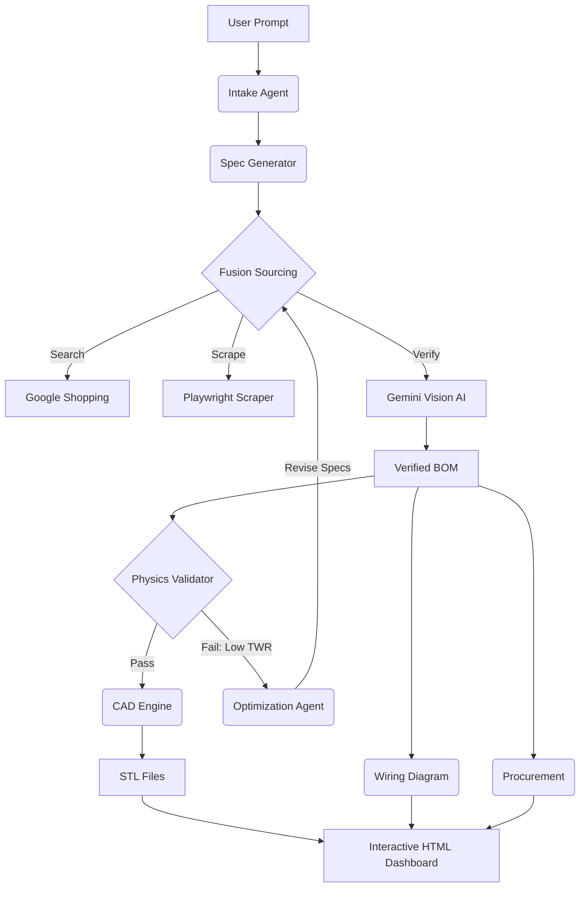

# drones
# 🚁 The Autonomous Drone Architect

### Generative Hardware Engineering with Level 4 AI Agents

**The Drone Architect** is an autonomous agentic framework capable of taking a high-level user prompt (e.g., *"I want a rugged 5-inch drone for filming digital video"*), sourcing real-world components, validating them against physics constraints, and generating manufacture-ready CAD files and assembly instructions.

Unlike standard LLMs which hallucinate physical specifications, this system uses a **"Hardware-Aware" architecture**. It grounds its creativity in reality by using Computer Vision to read datasheets, Python simulations to validate flight physics, and OpenSCAD to generate physical geometry.

---

## 🧠 System Architecture

The application executes a linear dependency graph where every stage acts as a logic gate for the next. It employs a **Self-Healing Feedback Loop** to correct engineering failures automatically.



## ✨ Key Features

*   **⚛️ Data Fusion Sourcing:** Orchestrates parallel searches across multiple vendors (Amazon, GetFPV, Pyrodrone). It merges the best *pricing* data with the best *technical* data (using Vision AI to read mounting patterns from diagrams) to create a "Composite Component."
*   **👁️ Computer Vision Verification:** Uses Gemini Pro Vision to "look" at product images and extract critical engineering constraints (e.g., "16x16mm bolt pattern") that are often missing from text descriptions.
*   **🚀 Physics Sandbox:** Runs a Dockerized physics engine to calculate Thrust-to-Weight Ratios (TWR), Disk Loading, and estimated flight times before a single part is bought.
*   **🔧 Self-Healing Logic:** If the physics simulation fails (e.g., the drone is too heavy), the **Optimization Agent** analyzes the failure and autonomously re-sources more powerful motors or higher voltage batteries.
*   **📐 Generative CAD:** Dynamically generates `.scad` and `.stl` files for the frame, tailored to the exact dimensions of the sourced components.
*   **⚡ Automated Electrical Engineering:** Generates a visual wiring schematic (PNG) showing exactly how to connect the specific peripherals (GPS, Receiver, VTX) to the selected Flight Controller.

## 🛠️ Tech Stack

*   **Core:** Python 3.10+, FastAPI
*   **Orchestration:** Celery, Redis
*   **Intelligence:** Google Gemini Pro (Logic), Gemini Pro Vision (Visual Extraction)
*   **Reconnaissance:** Playwright (Headless Browser), Serper/Google Search API
*   **Engineering:** OpenSCAD (Parametric CAD), Graphviz (Schematics), NumPy (Physics)
*   **Frontend:** Three.js (3D Visualization), TailwindCSS

---

## 🚀 Installation

### Prerequisites
*   **Docker & Docker Compose** (Recommended)
*   **API Keys:**
    *   `GOOGLE_API_KEY` (Gemini)
    *   `SERPER_API_KEY` (Google Shopping Search)

### 1. Clone the Repository
```bash
git clone https://github.com/yourusername/drone-architect.git
cd drone-architect
```

### 2. Configure Environment
Create a `.env` file in the root directory:
```bash
GOOGLE_API_KEY="your_gemini_key"
SERPER_API_KEY="your_serper_key"
DATABASE_URL="postgresql+asyncpg://user:password@db/drone_db"
CELERY_BROKER_URL="redis://redis:6379/0"
CELERY_RESULT_BACKEND="redis://redis:6379/0"
```

### 3. Run with Docker (Coming Soon)
```bash
docker-compose up --build
```

### 4. Manual Installation (Dev Mode)
If you prefer running locally without Docker, you must install system dependencies first:

```bash
# Install System Tools
sudo apt-get update
sudo apt-get install openscad graphviz

# Install Python Deps
pip install -r requirements.txt
playwright install chromium

# Run the Master Test
python -m scripts.test_all_systems
```

---

## 🎮 Usage

### The Master Pipeline
To witness the entire lifecycle from prompt to dashboard, run the master script:

```bash
python -m scripts.test_all_systems
```

1.  **Intake:** You will see the AI interview the "User" (simulated).
2.  **Sourcing:** Watch the logs as it scrapes real websites.
3.  **Physics:** It will report TWR. If < 1.5, watch it loop back and upgrade parts.
4.  **Visualization:** Finally, it will launch a web browser showing the **Interactive Assembly Guide**.

### The Dashboard
The final output is an HTML file located at `static/generated/master_build_guide.html`. It features:
*   **Interactive 3D Assembly:** Click "Next Step" to watch motors and props fly onto the frame.
*   **Wiring Diagram:** A generated schematic for your electronics.
*   **Procurement Manifest:** A cost breakdown grouped by vendor.

---

## 📂 Project Structure

```text
drone_architect/
├── app/
│   ├── services/           # The "Limbs"
│   │   ├── ai_service.py      # LLM Logic (The Brain)
│   │   ├── recon_service.py   # Web Scraper (The Eyes)
│   │   ├── vision_service.py  # Technical Diagram Reader
│   │   ├── physics_service.py # Flight Simulation
│   │   ├── cad_service.py     # OpenSCAD Generator
│   │   └── fusion_service.py  # Data Merger
│   ├── workers/            # Celery Tasks
│   └── main.py             # FastAPI Entrypoint
├── cad/
│   └── library.scad        # Parametric CAD Modules
├── scripts/                # Standalone Test Runners
├── static/
│   └── generated/          # Output STLs, JSONs, and HTML
└── templates/              # Visualization HTML Templates
```

---

## ⚠️ Disclaimer & Ethics

*   **Safety:** Lithium Polymer (LiPo) batteries and high-speed propellers are dangerous. This tool generates *theoretical* designs. Always verify wiring diagrams and physics calculations manually before powering up.
*   **Scraping:** The reconnaissance module uses a headless browser to scrape public e-commerce data. This is intended for personal, educational, or research use. Respect `robots.txt` and rate limits of target websites.

---

## 📜 License

MIT License. Build cool things. Fly safe.
