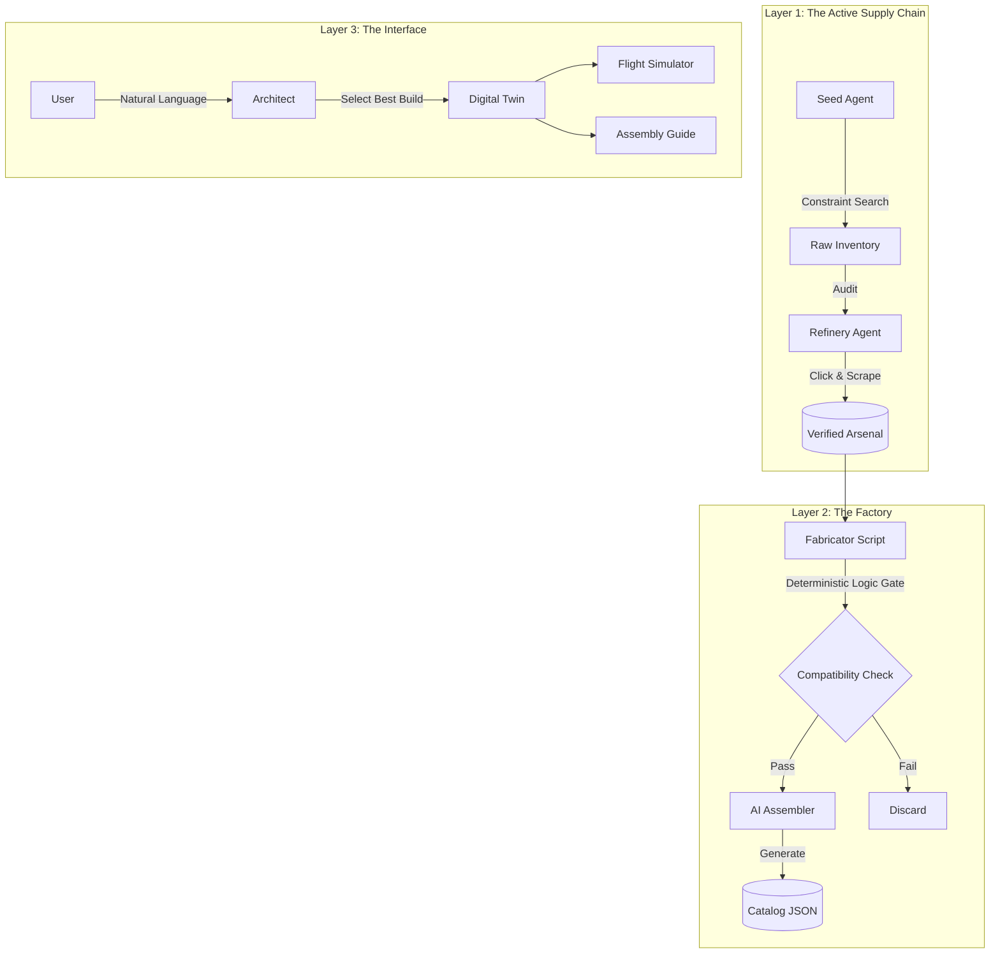

Drone_3 works end to end however the physics video game simulator needs work as drones are difficult to control and graphics could be less blocky.  However the serires or programs will render 2 drone constuctions which is pretty good since we start from scratch with some basic user requriments and end up with enough parts with good specs through the fusion process to create unique drones.  

# OpenForge: Neuro-Symbolic Manufacturing Engine

<div align="center">

[](https://www.python.org/)
[](https://www.gnu.org/licenses/agpl-3.0)
[]()

**The "Iron Man" Protocol for Hardware Engineering.**  
An AI system that builds its own inventory, manufactures virtual products, and simulates mission-critical robotics.

</div>

---

**OpenForge is not a chatbot.** It is a Hardware Compiler.

Traditional AI tools operate on text. OpenForge operates on **Physics and Supply Chains**. It utilizes a multi-agent architecture to scour the global market for components, verify them using Computer Vision, procedurally generate valid engineering assemblies, and simulate them in a browser-based physics engine.

It transforms **Natural Language Intent** (e.g., "I need to inspect fences autonomously") into **Verified Engineering Reality** (BOMs, Blueprints, and Flight Simulations).

---

## 🚧 State of the Union (Thanksgiving Update)

We have moved beyond simple RAG (Retrieval-Augmented Generation) into **Agentic Reasoning**.

*   **The Good:** The system can now "think" about requirements, search for specific hardware classes, autonomously browse websites to find hidden specs (via the Refinery Agent), assemble components in memory, and physically test them in a simulator. From a process standpoint, the architecture is sound.
*   **The Challenge:** We are pushing the boundaries of unstructured data extraction. While our "Active Recon" agents are impressive, they still struggle with the "Dirty Data" problem of the open internet (misclassified parts, vague product pages).
*   **Next Steps:** We are working on closing the loop—enabling the Fabricator to "reject and repair" data in real-time. If a part is missing a weight spec during assembly, the system should trigger a dedicated scraper to find just that one number.

---

## 🚀 Key Capabilities

### 1. The Arsenal (Active Supply Chain)
*   **The Constraint Chain:** We don't just search for "motors." An **Architect Agent** first translates user intent ("Brush Buster") into physics constraints ("Stator Volume > 2306", "Arm Thickness > 5mm").
*   **The Refinery:** A high-agency background worker (`refine_arsenal.py`) that audits the database. If a spec is missing, it spins up a headless browser, **clicks "Specifications" tabs**, reads the DOM, and updates the record.
*   **Visual Forensics:** Uses Vision AI to read PCB silkscreens and technical drawings to verify data that text scrapers miss.

### 2. The Fabricator (Logic-Gated Manufacturing)
*   **The Class Filter:** Instead of random combinations, the engine intelligently buckets parts (e.g., "7-inch Long Range", "Heavy Lift"). It only attempts to build drones with components in the same class.
*   **The Logic Gate:** A deterministic `CompatibilityService` that enforces hard physics rules *before* AI generation:
    *   **Voltage:** Checks `Battery Cells` vs `Motor KV` (Prevents fires).
    *   **Protocol:** Checks `UART Count` vs `Peripherals` (Prevents I/O bottlenecks).
    *   **Geometry:** Checks `Prop Size` vs `Frame Clearance` (Prevents collisions).

### 3. The Virtual Prototyping Lab (Simulation)
*   **Browser-Based Game Engine:** A fully interactive 3D simulator running on **Three.js** and **Cannon.js**.
*   **Real Physics:** Flight characteristics (inertia, drag, thrust) are derived from the actual mass and motor curves of the sourced parts.
*   **Procedural Environment:** The sim generates context-aware environments (Trees, Cows, Buildings) to test the drone's intended use case.

## 🛠️ Architecture

OpenForge separates Data Acquisition, Product Generation, and User Interaction into distinct layers.

<div align="center">


</div>

## 📦 Installation

#### Prerequisites
*   **Python 3.10+**
*   **Playwright:** Required for the active refinery agent.
*   **Google Gemini API Key:** (Visual Reasoning & Logic)
*   **Google Custom Search API Key:** (Web Recon)

#### Setup
1.  **Clone the repository:**
    ```sh
    git clone https://github.com/your-username/openforge.git
    cd openforge
    ```

2.  **Install dependencies:**
    ```sh
    pip install -r requirements.txt
    playwright install chromium
    ```

3.  **Configuration:**
    Set your API keys in `app/config.py` or environment variables.

## 🖥️ Usage

### 1. Seed & Refine (The Data Loop)
Populate your local database and let the AI "fix" missing data.
```sh
# Step 1: Broad search based on constraints
python tools/seed_arsenal.py

# Step 2: Active investigation (Clicks tabs, reads screenshots)
python tools/refine_arsenal.py

# Step 3: Grade your data quality
python tools/inspect_data_quality.py
```

### 2. Design the Fleet (The Logic Loop)
Ask the AI to select optimal combinations from your refined inventory.
```sh
python tools/design_fleet.py
```

### 3. Fly (The Simulation)
Launch the physics engine.
```sh
python tools/fly_drone.py
```

## 🗺️ Roadmap

| Feature | Status | Description |
| :--- | :--- | :--- |
| **Constraint Solving** | 🟢 **Done** | Translates "intent" to "physics" before sourcing. |
| **Active Refinery** | 🟢 **Done** | Agentic browsing to click UI elements and find hidden specs. |
| **Physics Logic Gate** | 🟢 **Done** | Deterministic code prevents AI from building unflyable drones. |
| **3D Simulator** | 🟢 **Done** | Procedural "Game Engine" based on real component specs. |
| **Feedback Loop** | 🟡 **In Progress** | If a build fails, auto-trigger the Sourcer to find the missing part. |
| **Cost Optimization** | 🔴 **Planned** | Genetic algorithm to find the cheapest valid configuration. |

## 📄 License

This project is licensed under the AGPL v3.
```
