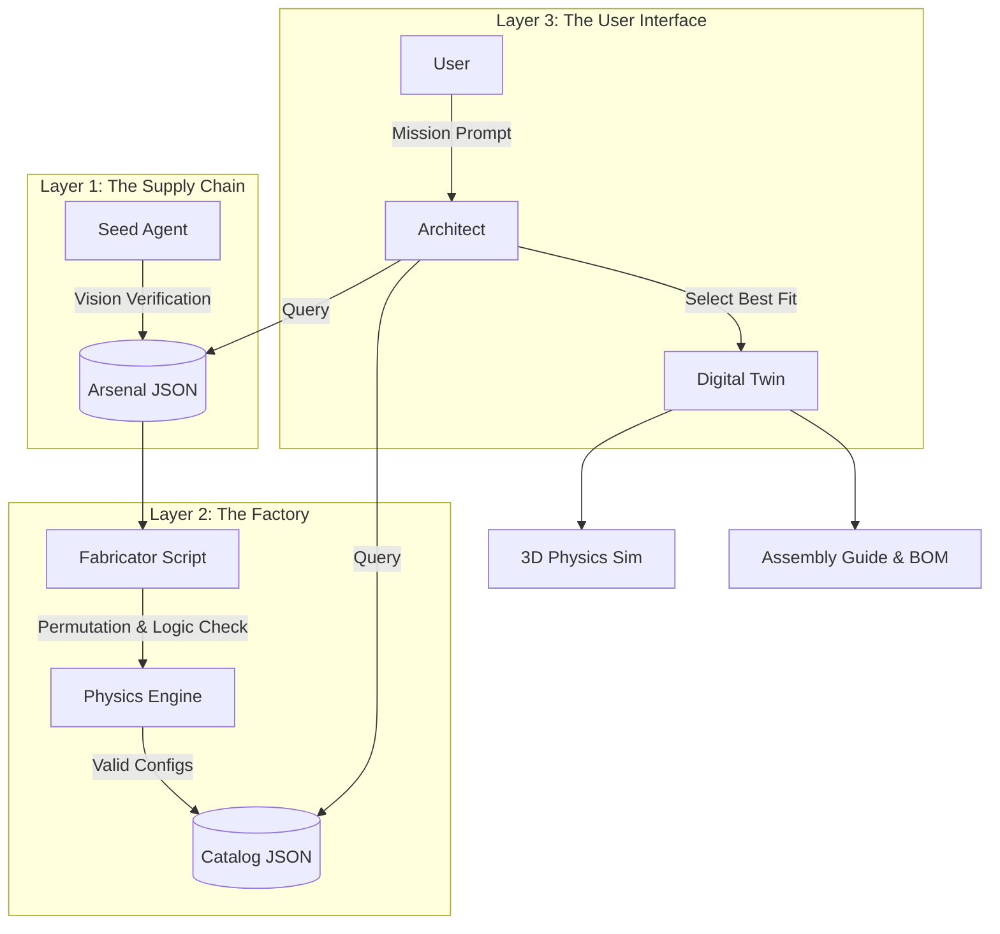

# OpenForge: Autonomous Supply Chain & Engineering Platform

<div align="center">

[](https://www.python.org/)
[](https://www.gnu.org/licenses/agpl-3.0)
[]()

**The "Iron Man" Protocol for Hardware Engineering.**  
An AI system that builds its own inventory, manufactures virtual products, and simulates mission-critical robotics.

</div>

---

**OpenForge is not a chatbot.** It is a Hardware Compiler.

Traditional AI tools operate on text. OpenForge operates on **Physics and Supply Chains**. It utilizes a multi-agent architecture to scour the global market for components, verify them using Computer Vision, procedurally generate valid engineering assemblies, and simulate them in a browser-based physics engine.

It transforms **Natural Language Intent** (e.g., "I need to inspect fences autonomously") into **Verified Engineering Reality** (BOMs, Blueprints, and Flight Simulations).

## 🚀 Key Capabilities

### 1. The Arsenal (Automated Supply Chain)
*   **The Night Shift:** A background agent (`seed_arsenal.py`) autonomously hunts for components. It verifies specs using **Vision AI** (reading PCB silk screens and technical drawings) to ensure data integrity.
*   **Robotics Aware:** Unlike simple scrapers, it understands the "Brain" of the drone. It identifies and tags components for **AI Compute** (Jetson/Pi), **Sensors** (Lidar/Depth), and **Firmware Compatibility** (ArduPilot/Betaflight).
*   **Visual DNA:** Extracts material properties (Carbon Fiber vs Aluminum, Matte vs Glossy) from product images to power the photorealistic simulator.

### 2. The Fabricator (Procedural Manufacturing)
*   **The SKU Generator:** A combinatorial engine (`fabricate_catalog.py`) that takes the verified parts list and procedurally attempts to build every possible valid drone configuration.
*   **The Filter:** It runs a **Master Builder** check (geometry fitment) and a **Physics Simulation** (flight dynamics) on every combination. If a drone doesn't fly or fit, it is discarded.
*   **The Catalog:** The result is a massive JSON database of thousands of pre-validated, flight-ready drone designs, complete with auto-generated marketing descriptions.

### 3. The Architect (Mission Engineering)
*   **Intent Analysis:** Translates vague user requests into precise engineering constraints (e.g., "Find cows" -> "Requires Thermal Camera + Edge AI Compute").
*   **Buy vs. Build:** The system analyzes the market to offer a strategic choice: **Buy** an off-the-shelf enterprise drone (found by the Scout Agent) or **Build** a custom rig (designed by the Engineer Agent).

### 4. The Virtual Prototyping Lab (Simulation)
*   **Browser-Based Game Engine:** A fully interactive 3D simulator running on **Three.js** (Graphics) and **Cannon.js** (Physics).
*   **Real Physics:** Flight characteristics (inertia, drag, thrust) are derived from the actual mass and motor curves of the sourced parts.
*   **Context-Aware Environments:** If you are a rancher, the sim loads a forest environment. If you are a filmmaker, it loads a city.

## 🛠️ Architecture

OpenForge separates Data Acquisition, Product Generation, and User Interaction into distinct layers.

<div align="center">


</div>

## 📦 Installation

#### Prerequisites
*   **Python 3.10+**
*   **OpenSCAD:** Required for manufacturing file generation.
    *   Linux: `sudo apt install openscad`
    *   Mac: `brew install --cask openscad`
    *   Windows: [Download Installer](https://openscad.org/)
*   **Google Gemini API Key** (Visual Reasoning)
*   **Google Custom Search API Key** (Web Recon)

#### Setup
1.  **Clone the repository:**
    ```sh
    git clone https://github.com/your-username/openforge.git
    cd openforge
    ```

2.  **Install dependencies:**
    ```sh
    pip install -r requirements.txt
    playwright install chromium
    ```

3.  **Configuration:**
    Set your API keys in `app/config.py` or environment variables.

## 🖥️ Usage

OpenForge is designed to run in three stages:

### 1. Seed the Arsenal (Data Acquisition)
Populate your local database with verified parts.
```sh
python tools/seed_arsenal.py
```

### 2. Fabricate Products (Data Processing)
Turn those parts into thousands of valid, pre-calculated drone configurations.
```sh
python tools/fabricate_catalog.py
```

### 3. Run the Architect (User Interface)
Launch the mission planner and simulator.
```sh
python main.py
```

## 🗺️ Roadmap & Feasibility

We are moving from a prototype to an enterprise standard. Here is the current status:

| Feature | Status | Description |
| :--- | :--- | :--- |
| **Constraint Solving** | 🟢 **Done** | Uses logic to ensure motors fit mounts and props fit frames. |
| **Curated Database** | 🟢 **Done** | `seed_arsenal.py` builds a verified local inventory via Vision AI. |
| **Physics Simulation** | 🟢 **Done** | `Cannon.js` integration maps real mass/thrust to simulation. |
| **Interconnect Logic** | 🟡 **Beta** | Heuristic analysis of cable lengths and connector types (XT30/60). |
| **Firmware Matrix** | 🟡 **Beta** | Infers ArduPilot/Betaflight compatibility via MCU type and scraping. |
| **Empirical Correction** | 🔴 **Planned** | RL loop to correct simulation parameters based on real flight logs. |
| **Regulatory/Safety** | 🔴 **Planned** | Auto-check compliance (e.g., <250g rule) based on region. |

## 📄 License

This project is licensed under the AGPL v3.
```
